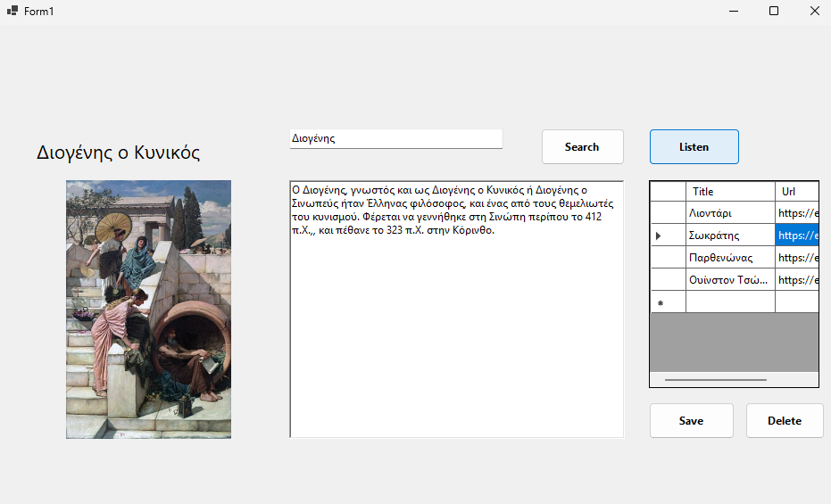
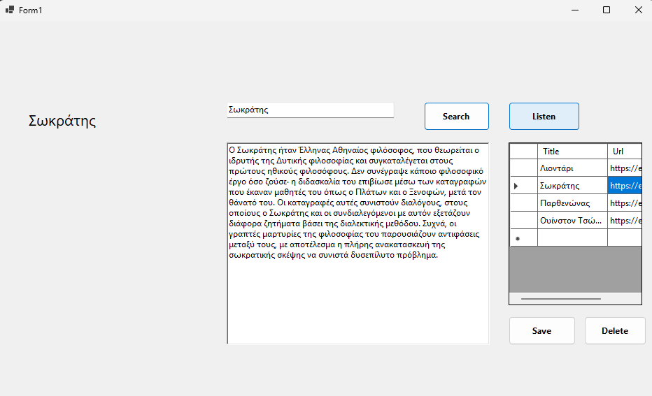

WikiApp

Η εφαρμογή αποτελεί μια εφαρμογή επιφάνειας εργασίας (Desktop Application) που προσφέρει γρήγορη και εύκολη πρόσβαση στο περιεχόμενο της ελληνικής Wikipedia. Μέσω ενός απλού και φιλικού περιβάλλοντος, ο χρήστης μπορεί να αναζητήσει οποιοδήποτε θέμα και να λάβει άμεσα μια περιεκτική σύνοψη συνοδευόμενη από την αντίστοιχη φωτογραφία.
Πέρα από την απλή ανάγνωση, η εφαρμογή υποστηρίζει φωνητική λειτουργία (Text-to-Speech), επιτρέποντας την ακρόαση του κειμένου για μεγαλύτερη ευκολία ή για λόγους προσβασιμότητας (δεν δουλεύει πάντα η βιβλιοθήκη). Τέλος, παρέχεται η δυνατότητα διαχείρισης "Αγαπημένων", όπου ο χρήστης μπορεί να αποθηκεύει μόνιμα τις αναζητήσεις που τον ενδιαφέρουν, σε μορφή link, σε μια τοπική βάση δεδομένων, ώστε να έχει άμεση πρόσβαση σε αυτές ακόμη και μετά την επανεκκίνηση της εφαρμογής.

